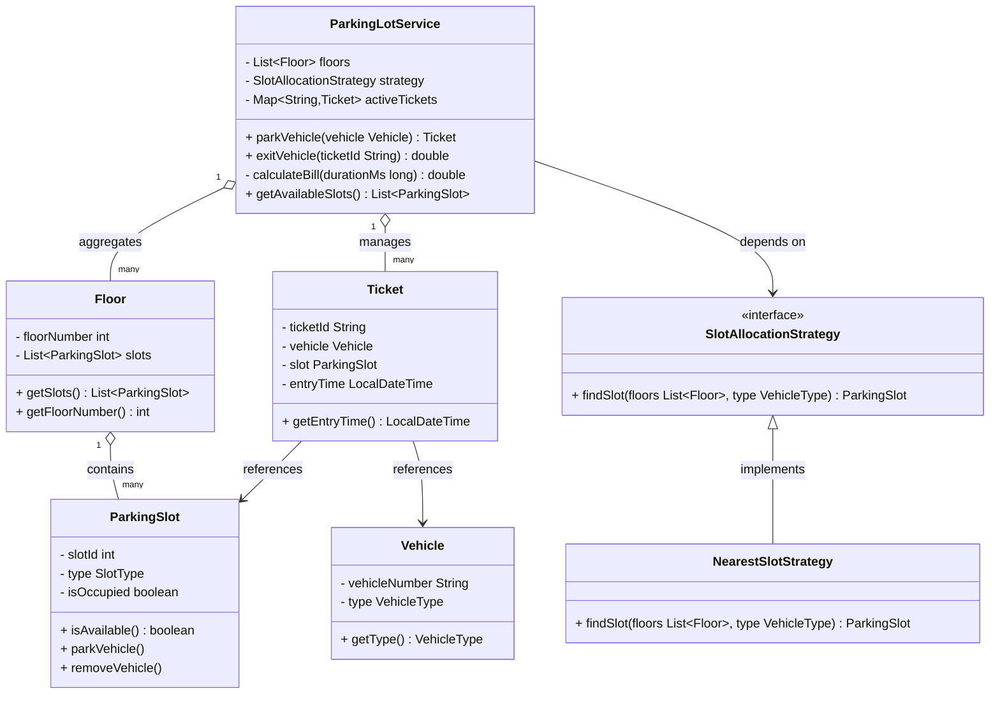

# Parking Lot — Low Level Design

> **Purpose:** Class-level design with clear responsibilities, relationships, and extensibility points.

---

## Class Responsibilities

| Class | Role | Key Responsibility |
|---|---|---|
| `Vehicle` | Data carrier | Holds vehicle number and type — no business logic |
| `ParkingSlot` | State manager | Tracks occupancy; exposes `parkVehicle()` / `removeVehicle()` |
| `Floor` | Container | Groups slots by level — aggregation only |
| `Ticket` | Immutable record | Links vehicle ↔ slot ↔ entry time for billing |
| `SlotAllocationStrategy` | Strategy interface | Contract for pluggable slot-finding logic |
| `NearestSlotStrategy` | Concrete strategy | Linear scan — O(n) first-available slot |
| `ParkingLotService` | Orchestrator | Park, exit, billing, active ticket registry |

---

## Enumerations

```
VehicleType  →  BIKE | CAR | TRUCK
SlotType     →  SMALL | MEDIUM | LARGE
```

---

## UML Class Diagram



---

## Relationships Summary

| Relationship | Type | Detail |
|---|---|---|
| `ParkingLotService` → `Floor` | Aggregation | Service owns a list of floors |
| `ParkingLotService` → `Ticket` | Aggregation | Maintains active ticket map |
| `ParkingLotService` → `SlotAllocationStrategy` | Dependency | Injected at construction — swappable |
| `Floor` → `ParkingSlot` | Aggregation | Floor contains 1..* slots |
| `Ticket` → `Vehicle` | Association | Ticket records which vehicle parked |
| `Ticket` → `ParkingSlot` | Association | Ticket records which slot was used |
| `NearestSlotStrategy` → `SlotAllocationStrategy` | Implementation | Concrete strategy via interface |

---

## Extensibility Points

- **New allocation strategy** — implement `SlotAllocationStrategy` and inject; zero changes to `ParkingLotService`
- **Pricing logic** — extract `calculateBill()` into its own strategy interface for time-based, flat-rate, or dynamic billing
- **Multi-entry/exit points** — `ParkingLotService` already decouples ticket management from physical layout
- **Floor addition** — floors are a plain `List<Floor>`; add/remove at runtime without restructuring

---

## Trade-offs & Notes

- `NearestSlotStrategy` does a **linear scan** — not true distance-based; suitable for small lots. For large lots, consider a priority queue keyed on proximity score.
- `Ticket` is treated as an **immutable record** after creation. Exit time and billing happen in `ParkingLotService`, not on the ticket itself.
- `SlotType` ↔ `VehicleType` mapping (which slot fits which vehicle) should live in `SlotAllocationStrategy`, not scattered across multiple classes.